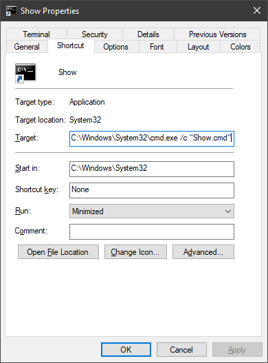
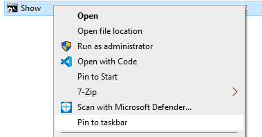

# ShowVM
 
VirtualBox Multiple Monitor Window Program

This is a very simple program to quickly display all the windows of a VM.
This is especially useful when the VM is assigned multiple virtual monitors that may be dispathed on your own physical monitors.

Program is available in [release](./release/).

## Help

Open a command prompt (cmd.exe) and look the help.

```cmd
ShowVM.exe help
```

## List VM Windows

Display a list of VM windows currently running. This program is limited to "Oracle VM VirtualBox" windows.

```cmd
ShowVM.exe list
```

## Display or Restore VM Windows

Please find some examples below.

Display the VM "MyUbuntu" with maximized windows, setting windows foreground. The command output verbose information.
```cmd
ShowVM.exe show --name MyUbuntu -v -d SW_SHOWMAXIMIZED -f
```

Display the virtual monitor 1 of VM "MyUbuntu" as maximized window and foreground. The command output verbose information.
```cmd
ShowVM.exe show --name MyUbuntu -v -d SW_SHOWMAXIMIZED -m 1 -f
```

## Usage

Get ShowVM in [release](./release/) folder and copy them on any directory.
Copy as well sample files:
- [Show.cmd](show.cmd)
- [Show](show) shortcut


## Shortcut pinned to Taskbar

Edit the shortcut [Show](show) (properties of the file) and set full path to file [Show.cmd](show.cmd). Once done, you can pin the shortcut to the taskbar. The shortcut is defined to run as "minimized" so that you don't see output.

```cmd
C:\Windows\System32\cmd.exe /c "C:\...\...\Show.cmd"
```





## Command

Edit the [Show.cmd](show.cmd) file with any text editor and personalize to display your VM windows as you like.


## Possible Improvements

- Reorder VM window icons in the taskbar to match the order of the physical monitor

Example:
Physical Monitor Layout: 
- 2 (left)
- 1 (right)

Virtual VM Monitor Layout:
- Virtual 2 bound to Physical 2
- Virtual 1 bound to Physical 1

Icons in the taskbar are displayed as Virtual 1 (icon on left) and Virtual 2 (icon on right).
I would prefer reordering them to have Virtual 2 and Virtual 1 so that icons match the layout of the physical monitor.

Or even remove VM icons from the taskbar to keep only ShowVM :)

This should probably require following APIs:
- [EnumDisplayMonitors](https://docs.microsoft.com/en-us/windows/win32/api/winuser/nf-winuser-enumdisplaymonitors)
- [GetWindowLong](https://docs.microsoft.com/en-us/windows/win32/api/winuser/nf-winuser-getwindowlongptrw)
- [SetWindowLong](https://docs.microsoft.com/en-us/windows/win32/api/winuser/nf-winuser-setwindowlongptrw)

Information found on [MSDN](https://social.msdn.microsoft.com/Forums/vstudio/en-us/64bb2f43-9104-4e92-aa0f-5d9ae283e2e6/how-in-user32-for-showintaskbar).


